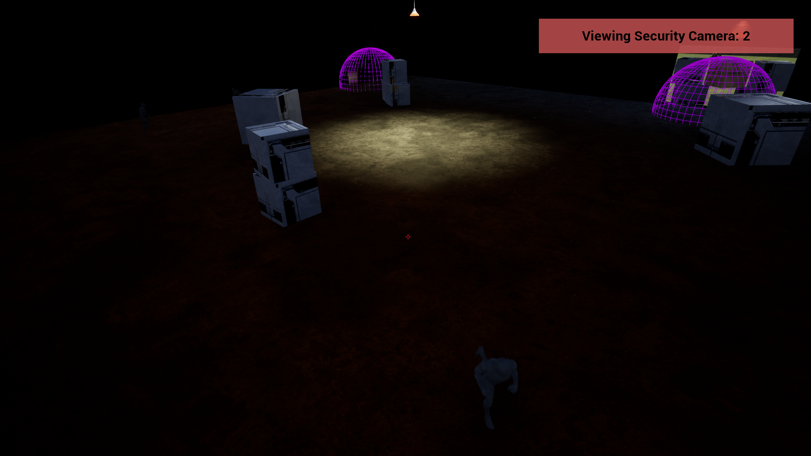
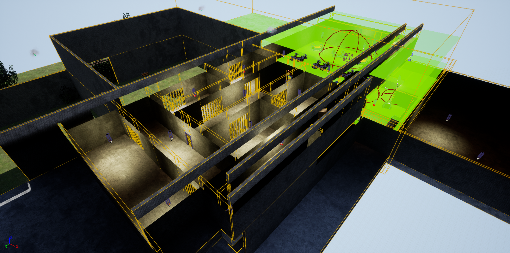

 
   

 

<h2>🗒️ Project Description</h2>

 

This project is a showcase of an AI implementation within a game in Unreal Engine 4. Within this game, the player must traverse a 3D environment while avoiding being discovered by multiple AI controlled characters that are patrolling the area. If one of the AI controlled characters discovers the player, they will proceed to chase the player and attempt to capture them. If this is successful, the game is restarted. If the player reaches the end of the map and escapes, the game is won.

https://www.youtube.com/watch?v=aY7v9pFhNBk

 

  
  

  
  

 

<h2>🛠️ Tools Used</h2>

 

 [Unreal Engine 4] - Primary Game Engine

 [Blender] - 3D Modelling

 [Git] - Source Control

 

 

  
  

  
  

  
  

  
  

  

 

<h2>🧠 Project Reflection</h2>

- **How would you describe the process of creating and polishing the artifact?**
  
Overall, this artifact was definitely one of the more challenging throughout my time working on university projects, as a lot of complex logic, ideas, and solutions were involved in the development of this experience. This was the first time developing an Unreal Engine 4 project using C++ rather then their blueprint system, so transferring all of the knowledge that I had gained into the C++ environment proved to be quite challenging at first. That being said, I feel that this project was still a fantastic experience, is I was able to learn an immense amount about the game engine, C++, pathfinding AI, navigation meshes, and more. I feel that the skills that were gained from working on this project will become extremely useful in projects that I work on in the future!
  
- **What did you learn as you were creating it and improving it?**

As I have worked with navigation meshes within other game engines on other projects, I feel that the primary skill that I learned throughout this project was using C++ within a game engine environment. As mentioned before, this was my first time to use C++ within Unreal Engine, though I had used it a bit within standalone projects. Because of this, there was a lot that I had to learn, as I was surprised to see how much was actually different between working on standalone projects with C++ versus using it for Unreal Engine game logic.

- **What challenges did you face?**

As mentioned before, the largest challenges that I faced during this project was the implementation of AI pathfinding and the navigation mesh within the game environment along with the utilization of C++ to create the game logic rather than Unreal Engine's Blueprint system. As the development of the project progressed, I became more and more comfortable with these tools, being able to rely on not only my experience with the Blueprint system, but also my prior experience with C++ and other object-oriented programming languages.

- **How did you incorporate feedback as you made changes to the artifact?**

Similar to many of my other projects, feedback was incorporated by keeping a solid lane of communication open between me and the client, in this case a professor. This project required me to both develop and refine a lot of skills in order to create the polished artifact, so this communication was extremely important in order to ensure the full realization of the final artifact as originally envisioned.

- **How was the artifact improved?**

This artifact was primarily improved by adding an additional, larger and more complex, level to the prototype while also incorporating and building on features that were developed and presented within the first level of the game. I wanted this new level to hold the dame ambience as the previous level, while introducing a much more complex and challenging environment to the player where they could utilize the skills gained within the first level. 

 

 

  

